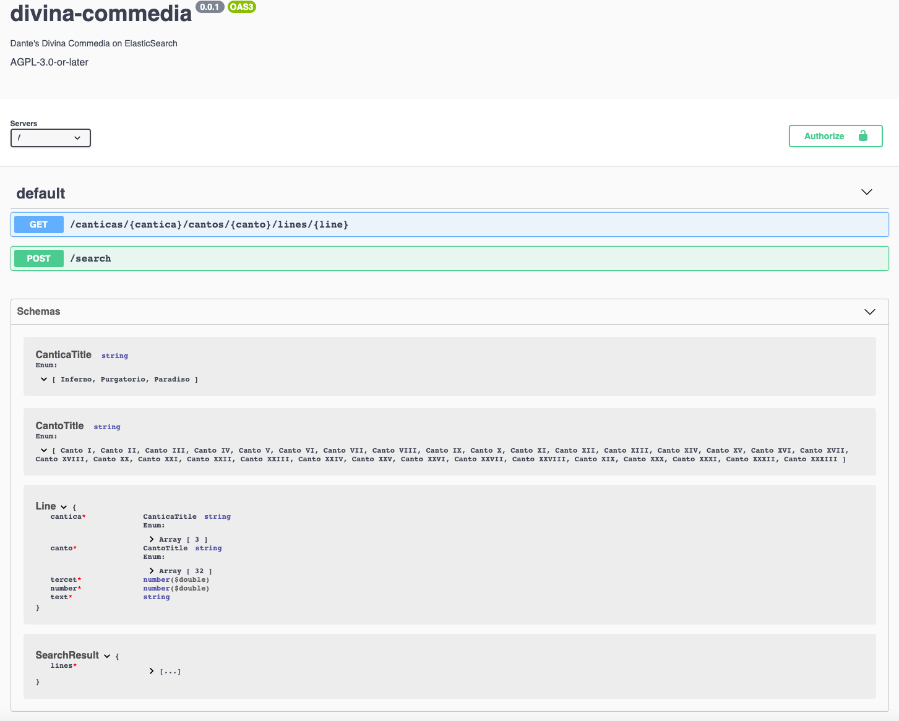

# Divina Commedia

Halfway along our life's path - I put [Dante's Comedy](https://en.wikipedia.org/wiki/Divine_Comedy) on Elasticsearch.

## Requirements

- [Node.js](https://nodejs.org/)
- [npm](https://www.npmjs.com/get-npm)

I recommend [Volta](https://volta.sh/), the hassle-free JavaScript tool manager which also manages package managers. The moment you `cd` into the project's root directory it will use the correct versions of node and npm. 

## Dependencies

- [Elasticsearch](https://www.elastic.co/elasticsearch/). Configuration options:    
    - `node`: the Url for [the client](https://www.elastic.co/guide/en/elasticsearch/client/javascript-api/current/typescript_examples.html#typescript_examples).
    - `numberOfReplicas`: for indices [settings](https://www.elastic.co/guide/en/elasticsearch/reference/current/indices-update-settings.html).


You can specify the configuration options in  a `JSON` file within the [config](config) directory. The name of the file must match the value of the `NODE_ENV` variable, which you must provide as environment variable. 

### With Docker

If you are running [Docker](https://www.docker.com/), you can use dependencies out of the box with

```bash
docker-compose up
```

The corresponding configuration options are provided for `NODE_ENV=dev` in [config/dev.json](config/dev.json). 

## Migrations

To start working on the Comedy with this project, you need to have its text on Elasticsearch. For that, use

```bash
NODE_ENV=dev npm run migrate
```

I intentionally added prints and sleeps so that you can observe the [Terzine](https://en.wikipedia.org/wiki/Terza_rima) while they are being stored, this causes the migrations to take some minutes - it can be almost instantaneous if those sleeps are removed.


## Linting

Powered by [ESLint](https://eslint.org/).

### Run the linter

```bash
npm run lint
```

### Let the linter fix your errors and ovverride the files

```bash
npm run lint:fix
```

## Formatting

Powered by [Prettier](https://prettier.io/)

### Format the code on demand

```bash
npm run format
```

### Check formatting without overriding the files

```bash
npm run format:check
```

### Format the code automatically on save

```bash
npm run format:watch
```

## Testing

Powered by [Jest](https://jestjs.io/) and [ts-jest](https://github.com/kulshekhar/ts-jest#readme)

```bash
npm run test
```

### With coverage report

```bash
npm run test:coverage
```

## Starting the API

OpenAPI-compliant REST APIs powered by [tsoa](https://github.com/lukeautry/tsoa#readme)



### With optimized build

```bash
NODE_ENV=dev npm run start
```

### With hot realod (for development)

```bash
NODE_ENV=dev npm run start:watch
```

## CI

Powered by [GitHub Actions](https://github.com/features/actions), runs the checks on push on the `main` branch, and on PRs (see [.github/workflows](.github/workflows)). 

## Further Steps

* Improve the analyzer and/or use NLP approaches to be better with [Dante's language](https://en.wikipedia.org/wiki/Dolce_Stil_Novo)
* Allow saving notes 
* Build a UI
* ...
